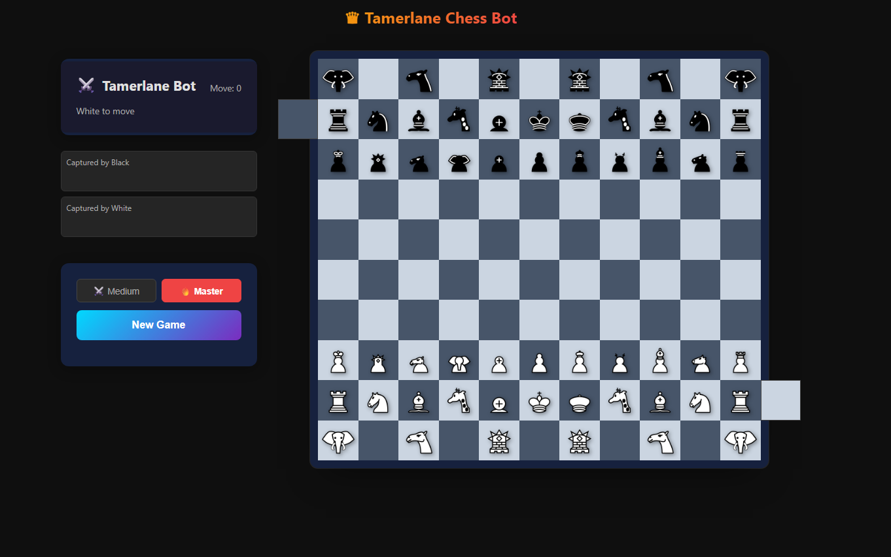

# ♟️ Tamerlane Chess - Bot & Web Interface


A high-performance, fully playable web implementation of **Tamerlane (Timur) Chess**, featuring a massive 11x10 board with Citadels and a custom mathematical AI engine built from scratch.

## 🛠️ Architecture & Tech Stack

This project is divided into two primary, highly optimized components:

### 🎮 1. The Frontend (TypeScript + React)

The user interface is built with **React** and **TypeScript**, bundled lightning-fast by **Vite**. It provides:

- A complete, interactive 11x10 chessboard (112 squares including Citadels).
- Drag-and-drop piece mechanics with visual move validators, explicitly mapped out for Tamerlane's unique pieces (e.g., Giraffe, Camel, War Engine).
- Real-time engine communication without freezing the UI, thanks to HTML5 Web Workers.

### 🧠 2. The Engine (Rust + WebAssembly)

To achieve Grandmaster-level calculations without slowing down the browser, the chess bot is written entirely in **Rust** and compiled mathematically down to **WebAssembly (WASM)**. Since Tamerlane Chess has 112 squares and highly exotic pieces (Giraffes, Camels, War Engines), standard algorithms fail. Therefore, the engine implements extremely specialized sub-algorithms:

- **Alpha-Beta Pruning (Minimax Strategy):** The core decision-maker. It rapidly traverses the move tree but aggressively discards ("prunes") branches that mathematically yield a worse outcome for the AI, allowing it to search much deeper within the time limit.
- **Quiescence Search:** The "tactical vision" sub-algorithm. Standard Alpha-Beta suffers from the _Horizon Effect_ (making a bad move because it couldn't see the capture coming one ply later). Quiescence forces the bot to mathematically resolve all active captures (e.g. trading rooks) before returning a final static evaluation score. This prevents blunders.
- **128 MB Zobrist Transposition Table:** Rather than re-evaluating the same sequence of moves, every unique board state is assigned a 64-bit Hash (Zobrist keys). If the AI reaches a position it already calculated from a different move order, it instantly fetches the stored mathematically optimal line, preserving exponential processing power.
- **Heuristic Piece-Square Tables (PST) & Mobility Calculations:** Gives the bot spatial awareness. Every specific piece type is assigned a geographical heatmap. For example, it calculates the vast domination range of a Giraffe, the fragility of a Camel in the dangerous central files, and highly prioritizes defending the two Citadels. It also calculates dynamic piece mobility: an immobilized piece is drastically lowered in value.
- **True Random Seed Jitter:** Chess engines can often play identically the same sequence. Powered by `js_sys::Math::random()`, the engine mathematically modifies centipawn evaluations capriciously every turn at the root. This guarantees non-deterministic, ever-changing Tamerlane openings.



## 🚀 Installation & How to Play Locally

To run this project on your machine, you will need [Node.js](https://nodejs.org/) installed. The Rust WASM bindings are pre-compiled and included in the repository, meaning **you do not need a Rust toolchain** just to play the game!

### 1. Clone the Repository

```bash
git clone https://github.com/YOUR_USERNAME/tamerlane-chess-bot.git
cd tamerlane-chess-bot
```

### 2. Install Dependencies

```bash
npm install
```

### 3. Start the Local Server

```bash
npm run dev
```

Finally, open exactly `http://localhost:3000` (or the port Vite provides) in your web browser to start playing against the engine.

_(If you wish to modify the Rust engine, you will need `wasm-pack`. Navigate to the `engine/` folder and run `wasm-pack build --target web --release`, then copy the output to the frontend.)_

## 🔮 Future Roadmap (NNUE)

Currently, the bot uses Hand-Crafted Evaluations (HCE) to judge positions. Given the absurd complexity of the 11x10 board, the ultimate next step will be integrating **NNUE (Efficiently Updatable Neural Networks)**. Training a neural network explicitly on Tamerlane chess games will allow the bot to intuitively "understand" positions rather than purely calculating them, unlocking superhuman playstyles.

---

_Note: Tamerlane Chess has an extensive, highly complex historical rulebook. For the sake of playability, performance, and standardizing the engine, a few ultra-specific edge-case rules regarding Royal piece promotions and strict Citadel interactions have been streamlined or excluded. These do not impact the core strategy or depth of the game._
